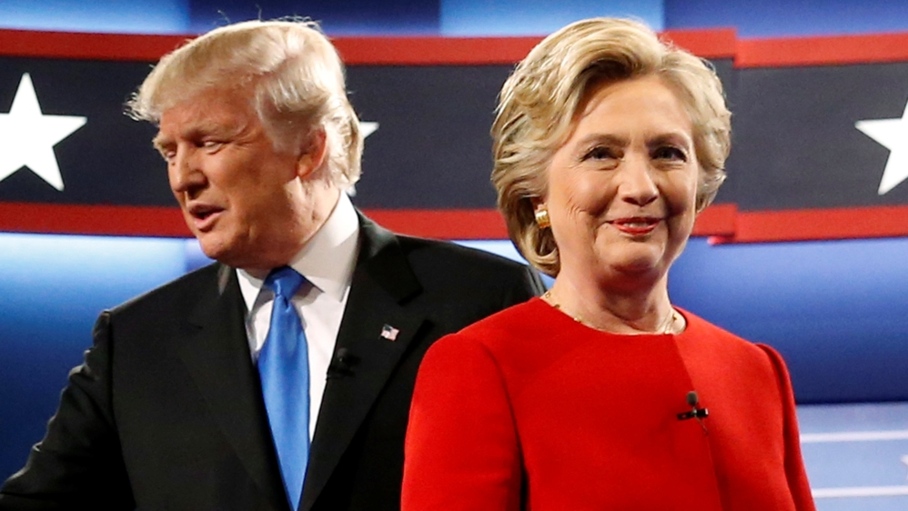

# 1. Introduction

The goal of the project is to closely examine the voting behaviors towards 2016 presidential election. By analyzing the data, we want to address questions like: 

* Does the survey result about who they voted agree on the actual election result? 
* Are there any demographic differences between the coalitions that support the two major party nominees? 
* Is this the case that people don't care about politics tend not to vote? 

**Dataset**: The *American National Election Studies* (ANES) are surveys of voters in the U.S. on the national scale. For each presidential election since 1948, ANES collects responses from respondents both before and after the election. In this project, I only use some of the features in the *Time Series Cumulative Data* of ANES for 2016.

```{r load libraries, warning=FALSE, message=FALSE, echo=FALSE}
packages.used=as.list(
  c(
  "tidyverse",
  "haven",
  "scales",
  "gridExtra",
  "devtools",
  "RColorBrewer",
  "data.table",
  "ggplot2")
)

check.pkg = function(x){
  if(!require(x, character.only=T)) install.packages(x, 
                                                     character.only=T,
                                                     dependence=T)
}

result <- lapply(packages.used, check.pkg)
```


```{r read data, warning=FALSE, message=FALSE, echo=FALSE}
anes_data <- read_sav("../data/anes_timeseries_cdf.sav")
```


Below is the peek of the data we are going to use in this project. 

```{r labelled variables subset, echo=TRUE}
anes_use <- anes_data %>%
  mutate(
    year=as_factor(VCF0004),
    race=as_factor(VCF0105b),
    gender=as_factor(VCF0104),
    age=as_factor(VCF0102),
    education=as_factor(VCF0110),
    class=as_factor(VCF0148a),
    votefor=as_factor(VCF0704),
    turnout=as_factor(VCF0702),
    interest=as_factor(VCF0310),
    discussion=as_factor(VCF0733),
    donation=as_factor(VCF0741)
  ) %>%
  filter(year == 2016)
```


```{r, echo=TRUE}
data.table(anes_use %>%
             select(turnout,votefor,
                    race,gender,age,education,class,
                    interest,discussion,donation)) %>%
  filter(!is.na(turnout)) %>%
  sample_n(10)
```

```{r save output data, warning=FALSE, echo=FALSE}
anes_use <- anes_use %>%
  select(turnout,votefor,race,gender,age,education,class,interest,discussion,donation) %>%
  filter(!is.na(turnout)) 
save(anes_use, file="../output/data_use.RData")
```


# 2. Data Analysis
## (i) General Statistics


```{r, warning=FALSE, echo=FALSE}
vote <- anes_use %>% 
  group_by(turnout) %>%
  tally()

percent <- vote %>%
  arrange(desc(turnout)) %>%
  mutate(group=turnout, 
         cumulative=cumsum(n),
         midpoint = cumulative-n/2,
         labels=paste0(round((n/sum(n))*100,2), "%"))

#first plot containing whether they vote or not
ggplot(percent, aes(x=1, y=n, fill=group)) +
  geom_bar(stat="identity", width=1) +
  coord_polar("y") +
  theme_void() +
  geom_text(aes(x=1, y=midpoint, label=labels)) +
  ggtitle("Who did you vote for?")
```

```{r, warning=FALSE, echo=FALSE}
dem_rep <- anes_use %>% 
  filter(turnout != "1. No, did not vote") %>%
  group_by(votefor) %>%
  tally()

dem_rep$votefor <- ifelse(is.na(dem_rep$votefor), "other", dem_rep$votefor)

table_percent <- dem_rep %>%
  arrange(desc(votefor)) %>%
  mutate(group=votefor, 
         cumulative=cumsum(n),
         midpoint = cumulative-n/2,
         labels=paste0(round((n/sum(n))*100,2), "%"))

#second plot containing what parties did they vote
ggplot(table_percent, aes(x="", y=n, fill=group)) +
  geom_bar(stat="identity", width=1) +
  coord_polar("y", start=0) +
  theme_void() +
  geom_text(aes(x=1, y=midpoint, label=labels)) +
  ggtitle("Did you vote?")
  
```


In our sample, there are 79% people chose to vote for the president in 2016, while only 21% chose not to vote. Among these people who voted, the overall vote preference mirrors the election results very closely: 47% of people voting for Democrat and 43% for Republican. 


## (ii) The demographic profiles of voters 

First we look at the people who voted. The first question I am interested in is: What kind of people chose to vote for Democrat/Republican? In order to answer the question, I grouped people by their gender, race and age, and I compute the percentage of each segment among their choice of vote.

```{r gender, warning=FALSE, echo=FALSE}
gender <- anes_use %>% 
  group_by(votefor, gender) %>%
  filter(!is.na(gender) & !is.na(votefor)) %>%
  tally() %>%
  mutate(percent=round((n/sum(n))*100,2),
         label_ypos=cumsum(percent) - 0.5*percent)

ggplot(data=gender, aes(x=votefor, y=percent, fill=gender)) +
  geom_bar(stat="identity") +
  geom_text(aes(y=100-label_ypos, label=percent), vjust=0.5, color="black", size=3.5) +
  labs(y="percentage (%)", title="GENDER") +
  scale_fill_brewer(palette="Oranges", direction=-1) 
```


```{r race, warning=FALSE, echo=FALSE}
race <- anes_use %>% 
  group_by(votefor, race) %>%
  filter(!is.na(race) & !is.na(votefor)) %>%
  tally() %>%
  mutate(percent=round((n/sum(n))*100,2),
         label_ypos=cumsum(percent) - 0.5*percent)

ggplot(data=race, aes(x=votefor, y=percent, fill=race)) +
  geom_bar(stat="identity") +
  geom_text(aes(y=100-label_ypos, label=percent), vjust=0.5, color="black", size=3.5) +
  labs(y="percentage (%)", title="RACE") +
  scale_fill_brewer(palette="Blues", direction=-1) 
```


```{r age,warning=FALSE, echo=FALSE}
age_group <- anes_use %>% 
  group_by(votefor, age) %>%
  filter(!is.na(age) & !is.na(votefor)) %>%
  tally() %>%
  mutate(percent=round((n/sum(n))*100,2),
         label_ypos=cumsum(percent) - 0.5*percent,
         cumulative=cumsum(percent))

ggplot(data=age_group, aes(x=votefor, y=percent, fill=age)) +
  geom_bar(stat="identity") +
  geom_text(aes(y=100-label_ypos, label=percent), vjust=0.5, color="black", size=3.5) +
  labs(y="percentage (%)", title="AGE") +
  scale_fill_brewer(palette="Reds") 

age_group %>%
  select(votefor, age, cumulative)
```


According to the three plots above, in 2016, a 58% majority of those who said to vote for Democrat were women, while Republican voters were more evenly divided between men and women (50.53% vs. 49.47%). White non-Hispanic constituted nearly 90% of Republican supporters, compared with a smaller majority (62%) who voted for Democrat. In contrast, Black non-Hispanic constituted 18% of Republican supporters, while only nearly 1% of Democrat supporters are Black non-Hispanic. Democrat's voters were also younger than Democrat's in general (40% were younger than 44, compared with 28% for Republican).


It's seems like people's level of education and their class also affect their choice of voting. I will also group people by education level and class to see the different constitutions between Republican voters and Democrat voters.


```{r education, warning=FALSE, echo=FALSE}
education <- anes_use %>% 
  group_by(votefor, education) %>%
  filter(!is.na(education) & !is.na(votefor)) %>%
  tally() %>%
  mutate(percent=round((n/sum(n))*100,2),
         label_ypos=cumsum(percent) - 0.5*percent)

ggplot(data=education, aes(x=votefor, y=percent, fill=education)) +
  geom_bar(stat="identity") +
  geom_text(aes(y=100-label_ypos, label=percent), vjust=0.5, color="black", size=3.5) +
  labs(y="percentage (%)", title="EDUCATION") +
  scale_fill_brewer(palette="Greens") 

```


```{r class, warning=FALSE, echo=FALSE}
class <- anes_use %>% 
  group_by(votefor, class) %>%
  filter(!is.na(class) & !is.na(votefor)) %>%
  tally() %>%
  mutate(percent=round((n/sum(n))*100,2),
         label_ypos=cumsum(percent) - 0.5*percent)

ggplot(data=class, aes(x=votefor, y=percent, fill=class)) +
  geom_bar(stat="identity") +
  geom_text(aes(y=100-label_ypos, label=percent), vjust=0.5, color="black", size=3.5) +
  labs(y="percentage (%)", title="CLASS") +
  scale_fill_brewer(palette="Purples") 

```


For education level, there are 51% who voted for Democrat have gained college or advanced degree, compared with 39% of Republican voters. People with high school education or some college education formed the major group of Republican voters (61%). People with higher and advanced education were more likely to support for the Democrat.
The class profile of the two parties' voters differed slightly. Around 21% of Democrat voters were from upper middle class, as were just 17% of Republican voters. The upper working class voters and average middle class voters distribute each party similarly (40% of Democrat voters were upper working class and 8% of them were average middle class, compared to 41% of Republican voters were upper working class and 8% were average middle class).


## (iii) How did 2016 voters and nonvoters compare?

As in the section 1 discussed, there are 78% people chose to vote for the president in 2016, while 21% chose not to vote. In this section, by analyzing and visualizing the data, we want to find the answer to the following question: How did 2016 voters and nonvoters compare in terms of their interests in politics and the election? 

```{r interest, warning=FALSE, echo=FALSE}
interest <- anes_use %>%
  select(turnout, interest) %>%
  filter(!is.na(turnout)) %>%
  group_by(turnout, interest) %>%
  tally()

ggplot(data=interest, aes(x=turnout, y=n, fill=interest)) +
  geom_bar(stat="identity", position=position_dodge()) +
  labs(y="count", title="Interest of politics between voters and nonvoters") +
  scale_fill_brewer(palette="Set2") 
```

I picked the question in the survey about how much have people been interested in the political campaigns: not much interested, somewhat interested, and very much interested. By looking at the plot, unsurprisingly, a large amount of people who voted in the election were very much interested in the political campaigns, while there were also some people who were not much interested in politics also voted. 


```{r discussion, warning=FALSE, echo=FALSE}
discussion <- anes_use %>%
  select(turnout, discussion) %>%
  filter(!is.na(turnout) & !is.na(discussion)) %>%
  group_by(turnout, discussion) %>%
  tally()

ggplot(data=discussion, aes(x=turnout, y=n, fill=discussion)) +
  geom_bar(stat="identity", position=position_dodge()) +
  labs(y="count", title="Discussion of politics between voters and nonvoters") +
  scale_fill_brewer(palette="Set2") 
```

The survey also asked about how many days in the past week did people talk about politics with family or friends. For people who voted in the 2016 election, they often talked about politics more than 5 days in a week, especially a large number of people talked about politics with their family and friends everyday. In the contrast, many people who did not vote in the election only discussed about politics less than 2 days a week. This result can validate my initial guess that people who are more engaged with political conversations are more likely to vote.


```{r donation, warning=FALSE, echo=FALSE}
donation <- anes_use %>%
  select(turnout, donation) %>%
  filter(!is.na(turnout) & !is.na(donation)) %>%
  group_by(turnout, donation) %>%
  tally()

donation

ggplot(data=donation, aes(x=turnout, y=n, fill=donation)) +
  geom_bar(stat="identity", position=position_dodge()) +
  labs(y="count", title="Donation for politics between voters and nonvoters") +
  scale_fill_brewer(palette="Set2") 

```

I also examined whether people have donated money to a particular individual candidate, a political party organization, people supporting a ballot proposition, or to a particular issue or interest group. For both groups, most of the people did not donate money to any of the groups mentioned above. Interestingly, there are 9 people who did not vote for the president used to give money to support campaigns. 

# 3. Conclusion


1. The survey in 2016 indicates that 43% of people voted for Democrat and 47% for Republican. It coordinates with the 2016 presidential election result that Donald Trump won the election. 

2. People's voting preference various demographically. Race was strongly correlated with voting preference in 2016. In addition, voting was also correlated with gender, age, and education. Whereas class had only a trivial correlation with people's voting preference in 2016.

3. People's interests in politics strongly affected their decisions of whether to vote. In general, people who were very much interested in political campaigns and often talked about politics in their daily life were more likeliy to vote. 


# 4. Improvement 

In this project, I only examine different groups' voting preferences for the 2016 presidential election. Since the whole dataset contains all the responses from people for each presidential election since 1948, it would be a very interesting topic to see whether groups voting preferences would change over time. 

Also, it would be fun if I can build a model using these features to predict the result of 2020 election and see the accuracy by comparing the model's result to the actual election result. 


